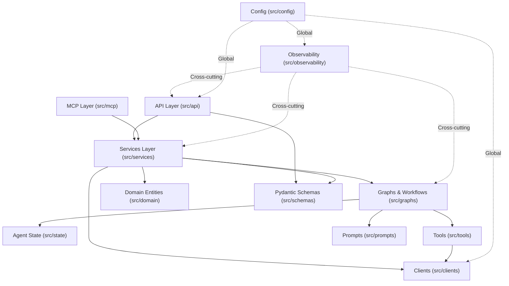

# Source Code Architecture (`src/`)

This document outlines the architectural patterns, directory structure, layer boundaries, and dependency rules governing the `src/` codebase. It is designed to guide both human engineers and AI coding agents when navigating, maintaining, or extending the repository.

---

## 1. Architectural Philosophy

The repository follows a **Clean Architecture / Ports & Adapters** paradigm adapted for modern LLM-driven applications and agentic workflows:

- **Strict Inward Dependency Flow**: Outer layers (API, Clients, Observability) depend on inner layers (Domain, State, Schemas). Inner layers **never** import from outer layers.
- **Framework Isolation**: Pure business logic and domain entities are decoupled from orchestration frameworks (LangGraph, FastAPI) and third-party SDKs.
- **Deterministic State Management**: Agent state transitions are explicit, typed, and isolated within dedicated state definitions and graph workflows.
- **Single Source of Truth**: Configuration and environment parsing are centralized in `src/config/`.



---

## 2. Directory Layout & Module Responsibilities

```
src/
├── api/             # FastAPI routers, endpoints, and HTTP middleware
├── mcp/             # MCP server/client implementations & protocol handling
├── graphs/          # LangGraph nodes, edges, and compiled workflows
├── tools/           # Native Python tools bound to LLMs
├── prompts/         # Standardised .md files, Jinja templates, system instructions
├── state/           # LangGraph State definitions and checkpointing logic
├── services/        # Logic orchestrating domain rules, clients, and graphs
├── domain/          # Core business entities and rules (zero external dependencies)
├── schemas/         # Pydantic models for API requests/responses and validation
├── clients/         # External integrations (HTTP clients, DB connectors)
├── observability/   # MLflow tracking and OpenTelemetry trace/span configurations
└── config/          # Pydantic-settings, env var loading, and global constants
```

### Module Breakdown

| Directory | Purpose | Allowed Dependencies | Prohibited Dependencies |
| :--- | :--- | :--- | :--- |
| `src/domain/` | Enterprise business entities, domain models, invariants | Standard Python library only | Any external framework (`fastapi`, `langchain`, `pydantic`, etc.) |
| `src/schemas/` | DTOs, request/response validation models, serialized schemas | `pydantic`, `src/domain/` | `src/api/`, `src/services/`, `src/graphs/` |
| `src/prompts/` | Prompt templates, system instructions, Jinja templates | Standard library, `jinja2` | `src/api/`, `src/services/`, `src/graphs/` |
| `src/clients/` | External SDK wrappers (OpenAI, Anthropic, DBs, Vector stores) | `httpx`, SDK packages, `src/config/` | `src/api/`, `src/services/`, `src/graphs/` |
| `src/graphs/` | LangGraph nodes, conditional edges, compiled workflows | `langgraph`, `src/state/`, `src/tools/`, `src/prompts/`, `src/clients/` | `src/api/`, `src/services/` |
| `src/services/` | Application business logic, graph invocation, domain execution | `src/domain/`, `src/schemas/`, `src/graphs/`, `src/clients/`, `src/config/` | `src/api/`, `src/mcp/` |
| `src/mcp/` | Model Context Protocol servers, clients, and resource adapters | `mcp`, `src/services/`, `src/schemas/`, `src/config/` | `src/api/` |
| `src/api/` | FastAPI routers, dependencies, middleware, HTTP status mapping | `fastapi`, `src/services/`, `src/schemas/`, `src/config/` | Internal graph nodes, raw DB clients |
| `src/observability/`| OTel spans, metrics, MLflow logging, structured logging | `opentelemetry`, `mlflow`, `src/config/` | `src/api/`, `src/services/` |
| `src/config/` | Environment variables, settings classes, constants | `pydantic-settings`, standard library | All other `src/` submodules |

---

## 3. Request & Data Flow Lifecycle

### 3.1 Inbound API Request Flow
1. **HTTP Ingestion**: `src/api/` receives the HTTP request and parses/validates the payload via `src/schemas/`.
2. **Service Dispatch**: The route handler delegates the business operation to `src/services/`.
3. **Graph Execution**: The service constructs the initial state (`src/state/`) and invokes the compiled graph (`src/graphs/`).
4. **Tool & Agent Loop**: Graph nodes process state, format prompts (`src/prompts/`), call models (`src/clients/`), and invoke tools (`src/tools/`).
5. **Domain Processing**: Output data is mapped into domain models (`src/domain/`) for business verification.
6. **Response Serialization**: The service returns data transformed into standard response schemas (`src/schemas/`) back through `src/api/`.

### 3.2 Inbound MCP Request Flow
1. **Protocol Ingestion**: `src/mcp/` receives a client tool/resource/prompt request over STDIO or SSE.
2. **Execution**: Delegates to the corresponding tool in `src/tools/` or service in `src/services/`.
3. **Response**: Formats result adhering to the MCP protocol specification.

---

## 4. Layer Separation Rules for AI Agents

When modifying or adding code to this codebase, always follow these rules:

1. **Do not put business logic in FastAPI routes**: All route functions must remain thin adapters that validate inputs and invoke services.
2. **Do not leak framework code into `src/domain/`**: Keep domain models independent of database ORMs, Pydantic, or LangChain.
3. **Define explicit state schemas**: Every LangGraph workflow must have a strongly typed state schema defined under `src/state/`.
4. **Keep prompts versioned and separate**: Never hardcode long multi-line system prompts inside graph node functions. Store them under `src/prompts/`.
5. **Use dependency injection for settings**: Access configuration via `src/config/` (e.g., `get_settings()`), never by directly reading `os.environ` inside feature modules.
6. **Cross-Cutting Observability**: Wrap long-running LLM calls, tools, and service boundaries with OpenTelemetry spans and log structured metrics via `src/observability/`.

---

## 5. Adding New Components (Cheat Sheet)

- **New REST Endpoint**:
  1. Add request/response models in `src/schemas/`.
  2. Implement business orchestration in `src/services/`.
  3. Create route in `src/api/routes.py` (or a dedicated router file) and mount to app.
- **New Agent / Workflow**:
  1. Define workflow state in `src/state/`.
  2. Create prompts in `src/prompts/`.
  3. Implement tool logic in `src/tools/`.
  4. Assemble and compile the graph in `src/graphs/`.
  5. Expose workflow through `src/services/`.
- **New Tool**:
  1. Define tool input schemas in `src/schemas/` or `src/tools/`.
  2. Implement the tool function in `src/tools/` with `@tool`.
  3. Bind to LLM in `src/graphs/` or register with `src/mcp/`.
